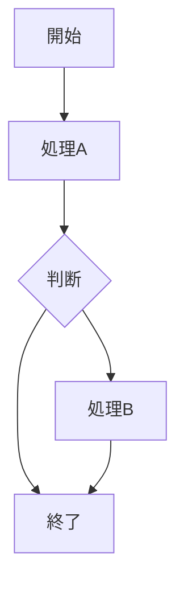

# CSV出力: test_mermaid.xlsx

## 概要

### ファイル情報

- 元のExcelファイル名: test_mermaid.xlsx
- シート数: 2
- 生成日時: 2026-05-13 13:37:55

### このファイルについて

このCSVマークダウンファイルは、AIがExcelの内容を理解できるよう、各シートの印刷領域をCSV形式で出力したファイルです。各シートはマークダウン見出しで区切られ、CSVコードブロックで内容が記載されています。ファイル末尾に検証用メタデータセクションがあり、Excel原本との整合性を確認できます。

### CSV生成方法

- **出力対象範囲**: 各シートの印刷領域のみを出力（印刷領域外のセルは含まない）
- **印刷領域の統合**: 複数の印刷領域がある場合は外接矩形として統合
- **テーブル分割なし**: Markdown出力と異なり、空行・空列でテーブル分割せず印刷領域全体を1つのCSVとして出力
- **結合セルの処理**: `top_left_only` 設定に従って処理
- **数式の扱い**: `display` 設定に従って表示値・数式・両方のいずれかを出力
- **値の正規化**: `True` 設定に従って正規化処理を適用

### CSV形式の仕様

- **区切り文字**: `,`
- **引用符の使用**: `minimal` 設定に従い、RFC 4180準拠で処理
- **セル内改行**: 半角スペースに変換される（1レコード=1行を保証）
- **セル内特殊文字**: 区切り文字や引用符は引用符でエスケープされる
- **エンコーディング**: `utf-8`
- **空セルの表現**: 空文字列として出力（空行・空列も含めて出力される）
- **ハイパーリンク**: 平文形式で出力（例: `表示テキスト (URL)` または `表示テキスト (→シート名+セル番号)`）

### Mermaidフローチャートについて

- ExcelのShape（図形）を検出し、Mermaid記法のフローチャートとして出力しています
- 各シートのCSVブロックの前に、検出されたShapeがMermaidコードブロックで記載されます
- Shape間の接続（コネクタ）も矢印として表現されます

### 検証用メタデータについて

- このファイルの末尾に「検証用メタデータ」セクションが付記されています
- メタデータには各シートのExcel原本情報（範囲、行数、列数）とCSV出力結果の比較が含まれます
- 検証ステータス（OK/FAILED）により、CSVとExcel原本の整合性を確認できます
- 詳細情報はファイル末尾の「検証用メタデータ」セクションを参照してください

---

## 図形フロー



```csv
図形：
- 矩形（処理）: 「開始」「処理A」「処理B」「終了」
- ひし形（判断）: 「判断」
- コネクタ（矢印）で接続
```

## テーブルフロー

```csv
From,To,Label
開始,処理A,
処理A,判断,実行
判断,処理B,Yes
判断,処理C,No
処理B,終了,
処理C,終了,
```

---

## 検証用メタデータ

- **生成日時**: 2026-05-13 13:37:55
- **元Excelファイル**: test_mermaid.xlsx
- **CSVマークダウンファイル**: test_mermaid_csv.md
- **CSVモード**: csv_markdown
- **検証フェーズ**: 1 (Basic - Row/Column Count)

### シート: 図形フロー

- **Excel範囲**: A1:A4
- **Excel行数**: 4
- **Excel列数**: 1
- **CSV行数**: 4
- **CSV列数**: 1
- **セル総数**: 4
- **ステータス**: OK

### シート: テーブルフロー

- **Excel範囲**: A1:C7
- **Excel行数**: 7
- **Excel列数**: 3
- **CSV行数**: 7
- **CSV列数**: 3
- **セル総数**: 21
- **ステータス**: OK

### 全体の検証結果

- **総セル数**: 25
- **検証ステータス**: OK
